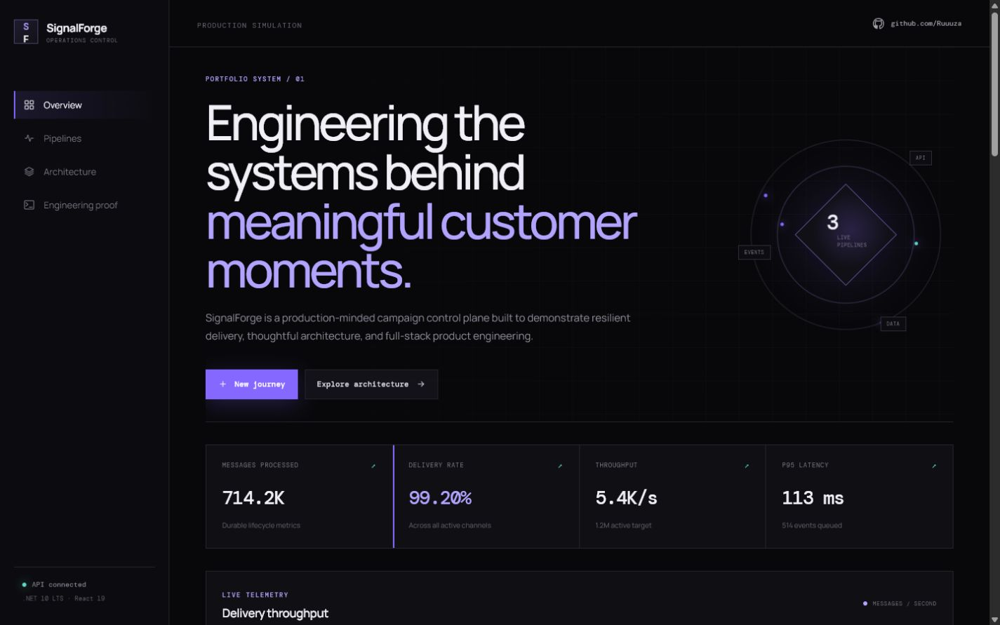

# RUZO SOLUTIONS

[](https://github.com/Ruuuza/SignalForge/actions/workflows/ci.yml)
[](https://github.com/Ruuuza/SignalForge/actions/workflows/codeql.yml)
[](https://dotnet.microsoft.com/)
[](LICENSE)

**A production-minded campaign operations control plane built with .NET 10 LTS, C# 14, React 19, and TypeScript.**

RUZO SOLUTIONS turns high-volume journey delivery into an observable system. This repository contains its SignalForge reference implementation: a compact but deep demonstration of campaign lifecycle, asynchronous processing, real-time operational feedback, durable state, resilient interfaces, and disciplined architectural boundaries.

> Designed and developed by Rodrigo Alves Ruza as an executable demonstration of senior full-stack delivery across projects of different scopes.



## Why this project exists

The repository translates real career signals into running software rather than presenting another static portfolio:

- intelligent campaign delivery and personalized customer journeys;
- robust messaging flows that reduce overhead and data loss;
- scalable APIs and responsive operational interfaces;
- coexistence with legacy systems and an intentional modernization path;
- cloud-ready delivery, observability, and automated quality gates;
- architecture that is practical today and extractable tomorrow.

## Product capabilities

- Live dashboard with throughput, queue depth, latency, and delivery quality
- Campaign creation and lifecycle commands with explicit domain invariants
- Durable SQLite persistence with zero infrastructure setup
- Asynchronous delivery simulation through a bounded background worker
- Real-time SignalR events and automatic client reconnection
- Responsive dark operations UI with accessible interaction states
- Resilient frontend demo snapshot when the API is unavailable
- REST, OpenAPI, health, compression, rate limiting, and Problem Details
- Multi-stage, non-root Docker image with persistent data and a health check
- Backend, frontend, test, container, CodeQL, and Dependabot automation

## Technology

| Concern | Choice |
| --- | --- |
| Runtime | .NET 10 LTS / ASP.NET Core 10 / C# 14 |
| Frontend | React 19 / TypeScript / Vite |
| Persistence | EF Core 10 / SQLite |
| Real time | SignalR |
| Architecture | Modular monolith / rich domain model / dependency inversion |
| Operations | Health checks / rate limiting / compression / structured logging |
| Delivery | Docker / Compose / GitHub Actions / CodeQL / Dependabot |
| Quality | xUnit / strict TypeScript / oxlint / warnings as errors |

## Run the complete product

### Docker

```bash
docker compose up --build
```

Open [http://localhost:8080](http://localhost:8080). Data is retained in the named `signalforge-data` volume.

### Local development

Requirements: .NET SDK 10 and Node.js 24 with pnpm 10.

```bash
dotnet run --project src/SignalForge.Api
```

In another terminal:

```bash
pnpm --dir src/SignalForge.Web install
pnpm --dir src/SignalForge.Web dev
```

Open [http://localhost:5173](http://localhost:5173). Vite proxies API and SignalR traffic to ASP.NET Core.

## Quality gate

```bash
dotnet restore
dotnet build --configuration Release --no-restore
dotnet test --configuration Release --no-build
pnpm --dir src/SignalForge.Web install --frozen-lockfile
pnpm --dir src/SignalForge.Web lint
pnpm --dir src/SignalForge.Web typecheck
pnpm --dir src/SignalForge.Web build
docker build -t signalforge:local .
```

## API surface

| Method | Endpoint | Purpose |
| --- | --- | --- |
| `GET` | `/api/dashboard` | Aggregated operational snapshot |
| `GET` | `/api/campaigns` | Campaign list and delivery state |
| `POST` | `/api/campaigns` | Create a validated draft campaign |
| `POST` | `/api/campaigns/{id}/launch` | Launch or resume a campaign |
| `POST` | `/api/campaigns/{id}/pause` | Pause a live campaign |
| `GET` | `/api/portfolio` | Project-to-career evidence map |
| `GET` | `/health` | Runtime health probe |
| WebSocket | `/hubs/delivery` | Live delivery event stream |

The OpenAPI document is exposed at `/openapi/v1.json` in Development.

## Repository structure

```text
src/
  SignalForge.Domain/          Business invariants and campaign lifecycle
  SignalForge.Application/     Use cases, contracts, and infrastructure ports
  SignalForge.Infrastructure/  EF Core, SQLite, repository, and demo seed
  SignalForge.Api/             HTTP edge, SignalR, worker, and composition root
  SignalForge.Web/             React operations console
tests/
  SignalForge.Tests/           Domain behavior tests
docs/
  architecture.md              Runtime and dependency model
  adr/                         Architectural decision records
```

Read [the architecture guide](docs/architecture.md) and [ADR 0001](docs/adr/0001-modular-monolith.md) for the reasoning behind the design.

## Engineering decisions

### Modular monolith first

Distribution is a deployment decision, not a prerequisite for good boundaries. SignalForge compiles the layers independently and keeps the domain free of framework concerns while shipping one low-friction runtime. The worker can later move behind Kafka or RabbitMQ without rewriting the business lifecycle.

### SQLite for self-sufficiency

The product starts without a database account, broker, or cloud subscription. EF Core keeps the persistence boundary portable, and Docker Compose retains state through a named volume. PostgreSQL is a straightforward production substitution.

### Reconciliation plus live events

SignalR makes operations immediate; periodic dashboard refresh reconciles the client with durable truth. Losing a transient event therefore never leaves the UI permanently inconsistent.

### Explicit tradeoffs

- The worker simulates transport adapters; a production system would use an outbox plus Kafka or RabbitMQ.
- Authentication is intentionally outside this public demo; production should integrate an OIDC provider at the edge.
- SQLite favors local autonomy over horizontal write scaling.
- Metrics are operational demo data, not business claims from prior employers.

## Security and license

Review [SECURITY.md](SECURITY.md) before reporting a vulnerability. The project is available under the [MIT License](LICENSE).
