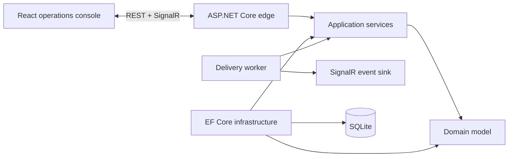

# Architecture

Ruzo Solutions uses a modular monolith because it offers the best local developer experience without sacrificing boundaries. The runtime is one deployable unit; the code remains organized around stable dependency direction.

## Dependency direction

- **Domain** contains campaign lifecycle rules and has no infrastructure dependencies.
- **Application** defines use cases, DTOs, and ports.
- **Infrastructure** implements persistence behind the application ports.
- **API** is the composition root and owns HTTP, SignalR, background execution, and cross-cutting middleware.
- **Web** is a typed React client with a resilient read-only snapshot when the API is unavailable.

## Runtime flow

1. A campaign is created through the REST edge.
2. The application service constructs a valid domain aggregate.
3. EF Core stores the aggregate in SQLite.
4. The background worker claims bounded batches from live campaigns.
5. Domain methods record delivery outcomes and enforce lifecycle transitions.
6. SignalR publishes operational events to every connected console.
7. The dashboard periodically reconciles its snapshot with durable state.

## Evolution path

If scale or team ownership requires distribution, the delivery worker and event stream can move behind Kafka or RabbitMQ while retaining application contracts. SQLite can be replaced with PostgreSQL through the repository boundary. This is a deliberate extraction path, not speculative microservice complexity.
